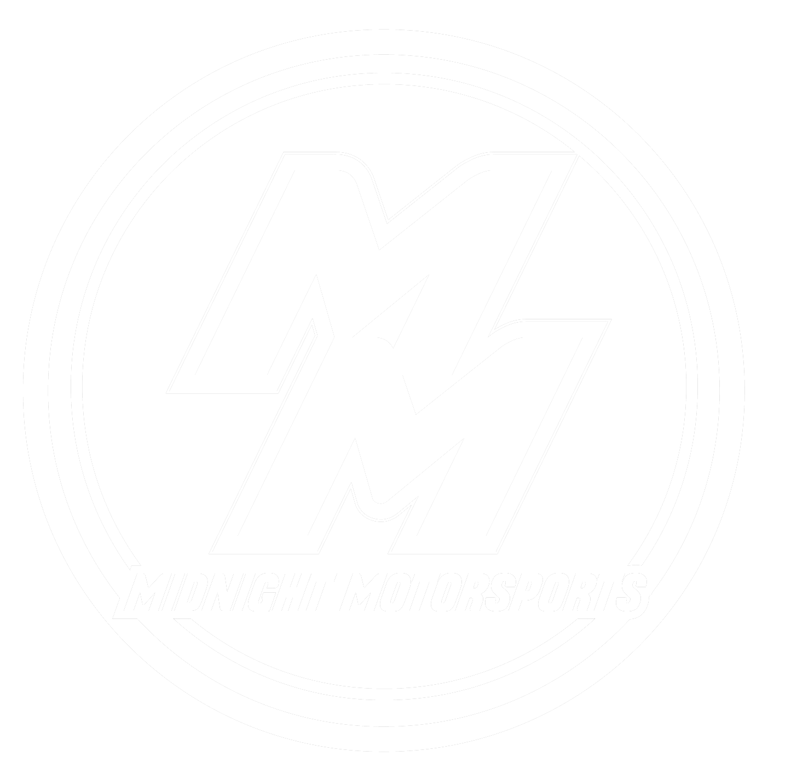

<div id="top"></div>
<!--
*** Thanks for checking out the Best-README-Template. If you have a suggestion
*** that would make this better, please fork the repo and create a pull request
*** or simply open an issue with the tag "enhancement".
*** Don't forget to give the project a star!
*** Thanks again! Now go create something AMAZING! :D
-->


<!-- PROJECT SHIELDS -->
<!--
*** I'm using markdown "reference style" links for readability.
*** Reference links are enclosed in brackets [ ] instead of parentheses ( ).
*** See the bottom of this document for the declaration of the reference variables
*** for contributors-url, forks-url, etc. This is an optional, concise syntax you may use.
*** https://www.markdownguide.org/basic-syntax/#reference-style-links
-->
[![Contributors][contributors-shield]][contributors-url]
[![Forks][forks-shield]][forks-url]
[![Stargazers][stars-shield]][stars-url]
[![Issues][issues-shield]][issues-url]
[![License][license-shield]][license-url]


<!-- PROJECT LOGO -->
<br />
<div align="center">
  <a href="https://github.com/maxwellwalin/midnightmotorsports-next">
    
  </a>

<h3 align="center">Midnight Motorsports</h3>

  <p align="center">
    An eCommerce that utilizes Next.js and Keystone.js to provide both the business owner and customer with a seamless, streamlined experience.
    <br />
    <a href="https://github.com/maxwellwalin/midnightmotorsports-next"><strong>Explore the docs »</strong></a>
    <br />
    <br />
    <a href="https://github.com/maxwellwalin/midnightmotorsports-next">View Demo</a>
    ·
    <a href="https://github.com/maxwellwalin/midnightmotorsports-next/issues">Report Bug</a>
    ·
    <a href="https://github.com/maxwellwalin/midnightmotorsports-next/issues">Request Feature</a>
  </p>
</div>


<!-- TABLE OF CONTENTS -->
<details>
  <summary>Table of Contents</summary>
  <ol>
    <li>
      <a href="#about-the-project">About The Project</a>
      <ul>
        <li><a href="#built-with">Built With</a></li>
      </ul>
    </li>
    <li>
      <a href="#getting-started">Getting Started</a>
      <ul>
        <li><a href="#prerequisites">Prerequisites</a></li>
        <li><a href="#installation">Installation</a></li>
      </ul>
    </li>
    <li><a href="#usage">Usage</a></li>
    <li><a href="#roadmap">Roadmap</a></li>
    <li><a href="#contributing">Contributing</a></li>
    <li><a href="#license">License</a></li>
    <li><a href="#contact">Contact</a></li>
    <li><a href="#acknowledgments">Acknowledgments</a></li>
  </ol>
</details>


<!-- ABOUT THE PROJECT -->
## About The Project

[![Product Name Screen Shot][product-screenshot]](https://example.com)

We partnered with Chris of Midnight Motorsports in Lake Forest, CA to create an eCommerce app on which he would be able to sell cart parts that he is licensed to sell as a dealer. Since we use Keystone.js, Chris is consistently able to add, edit, and remove content like car parts, models, makes, etc. using the Keystone admin UI. 

<p align="right">(<a href="#top">back to top</a>)</p>


### Built With

* [Next.js](https://nextjs.org/)
* [React.js](https://reactjs.org/)
* [Keystone.js](https://keystonejs.com/)
* [MongoDB](https://www.mongodb.com/)
* [Node.js](https://nodejs.org/en/)
* [Styled Components](https://styled-components.com/)
* [GraphQL](https://graphql.org/)
* [Apollo](https://www.apollographql.com/)
* [Bootstrap](https://getbootstrap.com)

<p align="right">(<a href="#top">back to top</a>)</p>


<!-- GETTING STARTED -->
## Getting Started

Get a local copy up and running by following these simple steps.

### Prerequisites

npm and Node.js are required to run a local copy of this project.
* npm
  ```sh
  npm install npm@latest -g
  ```
* [Node.js](https://nodejs.org/en/)


### Installation

1. Clone the repo
   ```sh
   git clone https://github.com/maxwellwalin/midnightmotorsports-next.git
   ```
2. Install NPM packages
   ```sh
   npm install
   ```
3. Start development server
   ```sh
   npm run develop
   ```

<p align="right">(<a href="#top">back to top</a>)</p>

<!-- ROADMAP -->
## Roadmap

- [] Generate and email POs upon checkout success
- [] Dropshipping from manufacturers and vendors

See the [open issues](https://github.com/maxwellwalin/midnightmotorsports-next/issues) for a full list of proposed features (and known issues).

<p align="right">(<a href="#top">back to top</a>)</p>


<!-- CONTRIBUTING -->
## Contributing

Contributions are what make the open source community such an amazing place to learn, inspire, and create. Any contributions you make are **greatly appreciated**.

If you have a suggestion that would make this better, please fork the repo and create a pull request. You can also simply open an issue with the tag "enhancement".
Don't forget to give the project a star! Thanks again!

1. Fork the Project
2. Create your Feature Branch (`git checkout -b feature/AmazingFeature`)
3. Commit your Changes (`git commit -m 'Add some AmazingFeature'`)
4. Push to the Branch (`git push origin feature/AmazingFeature`)
5. Open a Pull Request

<p align="right">(<a href="#top">back to top</a>)</p>


<!-- LICENSE -->
## License

Distributed under the APGL-3.0 License. See `LICENSE.txt` for more information.

<p align="right">(<a href="#top">back to top</a>)</p>


<!-- CONTACT -->
## Contact

Jesus Bautista, Daniel Stark, Maxwell Walin, Parth Bhatt - djmpdevs@gmail.com

Project Link: [https://github.com/maxwellwalin/midnightmotorsports-next](https://github.com/maxwellwalin/midnightmotorsports-next)

<p align="right">(<a href="#top">back to top</a>)</p>

<!-- MARKDOWN LINKS & IMAGES -->
<!-- https://www.markdownguide.org/basic-syntax/#reference-style-links -->
[contributors-shield]: https://img.shields.io/github/contributors/maxwellwalin/midnightmotorsports-next.svg?style=for-the-badge
[contributors-url]: https://github.com/maxwellwalin/midnightmotorsports-next/graphs/contributors
[forks-shield]: https://img.shields.io/github/forks/maxwellwalin/midnightmotorsports-next.svg?style=for-the-badge
[forks-url]: https://github.com/maxwellwalin/midnightmotorsports-next/network/members
[stars-shield]: https://img.shields.io/github/stars/maxwellwalin/midnightmotorsports-next.svg?style=for-the-badge
[stars-url]: https://github.com/maxwellwalin/midnightmotorsports-next/stargazers
[issues-shield]: https://img.shields.io/github/issues/maxwellwalin/midnightmotorsports-next.svg?style=for-the-badge
[issues-url]: https://github.com/maxwellwalin/midnightmotorsports-next/issues
[license-shield]: https://img.shields.io/github/license/maxwellwalin/midnightmotorsports-next.svg?style=for-the-badge
[license-url]: https://github.com/maxwellwalin/midnightmotorsports-next/blob/master/LICENSE.txt
[product-screenshot]: ./client/public/images/about-ss.png
